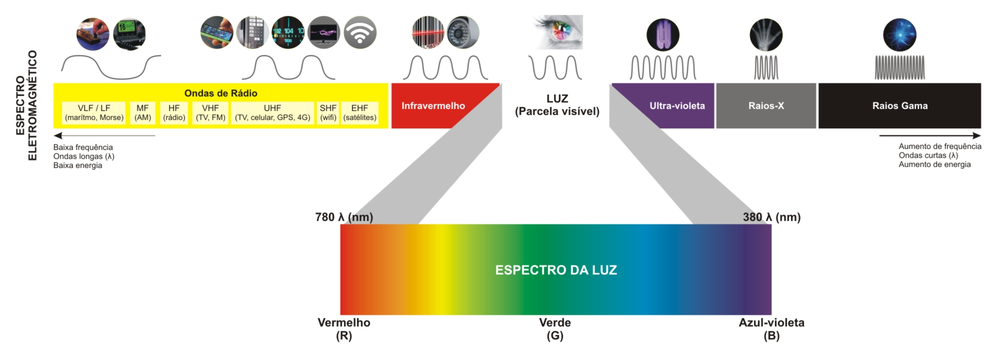
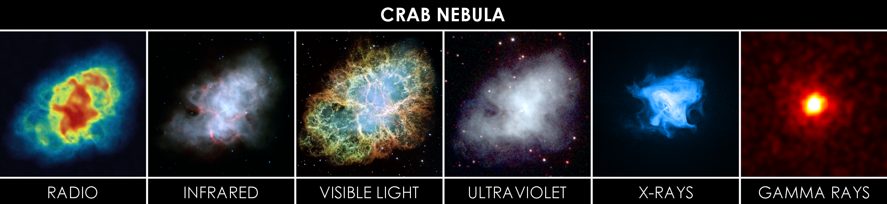

# Introdução

## Aplicações

<!--- 

*Fig. 1: Espectro Eletromagnético*

- Imagens formadas por <b>raios gama</b>: São muito utilizadas na medicina e astronomia. Na medicina, existem procedimentos onde se injetam isótopos radioativos no paciente e por meio dos detectores de raio gama é formada uma imagem, como exemplo, escaneamento ósseo e tomografia por emissão de pósitrons (PET-scan). Na astronomia, ela pode ser utilizada  para se conseguir ver detalhes astronômicos que estão presentes na faixa eletromagnética dos raios gama.

- Imagens formadas por <b>raios X</b>: Têm uma ampla gama de aplicações, desde seu uso na medicina até seu uso no meio industrial. Na indústria, pode ser utilizado para se encontrar defeitos de fabricação em produtos, e na medicina, vêm se utilizando muito o processamento de imagem e a visão computacional para ajudar no diagnóstico de doenças, como por exemplo, artérias obstruídas.

- Imagens na <b>banda ultravioleta</b>: O espectro ultravioleta também tem inúmeras aplicações, como a inspeção industrial, microscopia, imagens biológicas e observações astronômicas.

- Imagens na <b>banda visível e infravermelho</b>: Essas duas bandas possuem uma gama extremamente ampla de aplicações, sendo utilizadas juntas ou separadas. Na banda visível, existem diversas aplicações, como em processos industriais, detecção de faces, detecção de placas de carros, etc. A banda infravermelho também possui inúmeras aplicações, sendo uma delas no imagens a partir de satélites, onde o infravermelho nos permite ver inúmeros detalhes que somente com a banda visível não seria possível.

- Imagens na <b>banda de micro-ondas e rádio</b>: Na banda de micro-ondas o melhor exemplo que temos é o radar. Essa banda tem uma peculiaridade de ser extremamente penetrante, podendo gerar imagens através de nuvens, vegetação, etc. Já a banda de rádio é muito utilizada na medicina, como exemplo na ressonância magnética e na astronomia.
  
Como podemos observar, existem inúmeras maneiras de se conseguir imagens além da clássica imagem no espectro visível, isso nos dá a possibilidade de utilizar o PDI em inúmeras áreas e problemas.

*Fig. 2: Nebulosa do Caranguejo em diferentes frequências*
-->
## Relação entre Processamento Digital de Imagens(PDI), Visão Computacional e Computação Gráfica(CG)
<!--- 
|Processamento Digital de Imagens(PDI) |  Visão Computacional | Computação Gráfica(CG)|
|---|---|---|
|Transformação de imagem(tratamento) | Análise de imagem para criação de modelos | Cria e altera imagens a partir de dados|
|Imagem → Imagem | Imagem → Modelo | Modelo → Imagem|
-->
## Etapas de PDI